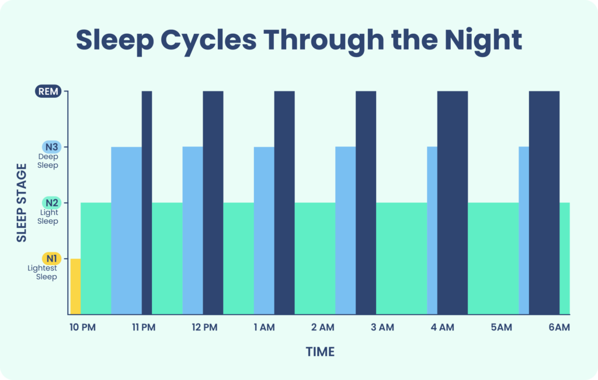

# Fases do Sono

Nos temos no total 4 fases de sono, sendo elas:

|Fases do sono|Caracteristicas|Duração|
|-------------|---------------|-------|
|**NREM(Não REM) 1**|transição da vigília para o sono leve|1 a 5 minutos|
|**NREM(Não REM) 2**|sono leve ganhando profundidade|10 a 60 minutos|
|**NREM(Não REM) 3**|sono profundo|20 a 40 minutos|
|**REM**|movimentos rápidos dos olhos, ondas cerebrais, respiração e batimento cardíaco próximos ao da vigília, músculos paralisados|10 a 60 minutos|

Em media uma noite de sono normal para uma pessoa é de 4 a 6 ciclos de sono. Então essas fases funciona em um tipo de loop, que sempre acaba o *REM* ele retorna para o inicio, além disso ocorre a diminuição do *NREM 3* e *NREM 1*, e o aumento do do *NREM 2* e *REM*.

